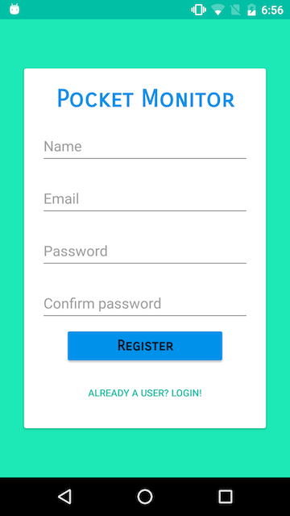
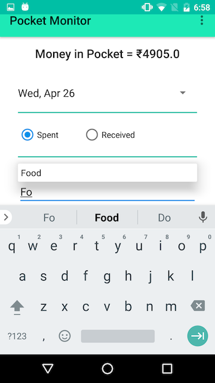
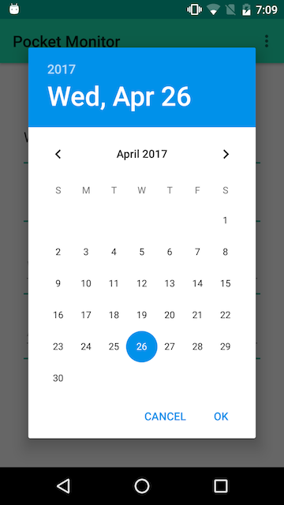
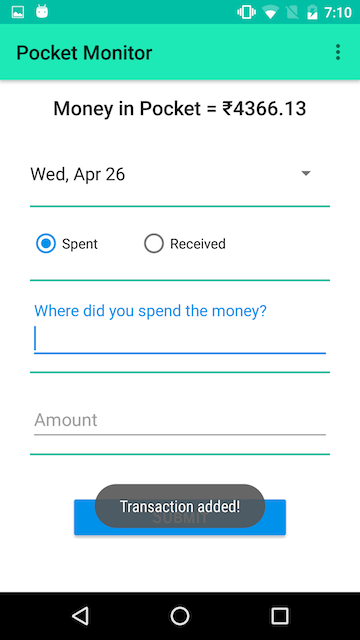

# PocketMonitor

PocketMonitor is a fullstack Android development project with PHP that implements the latest material design specifications. It helps keeps track of the money spent and received by the user.

## Screenshots

